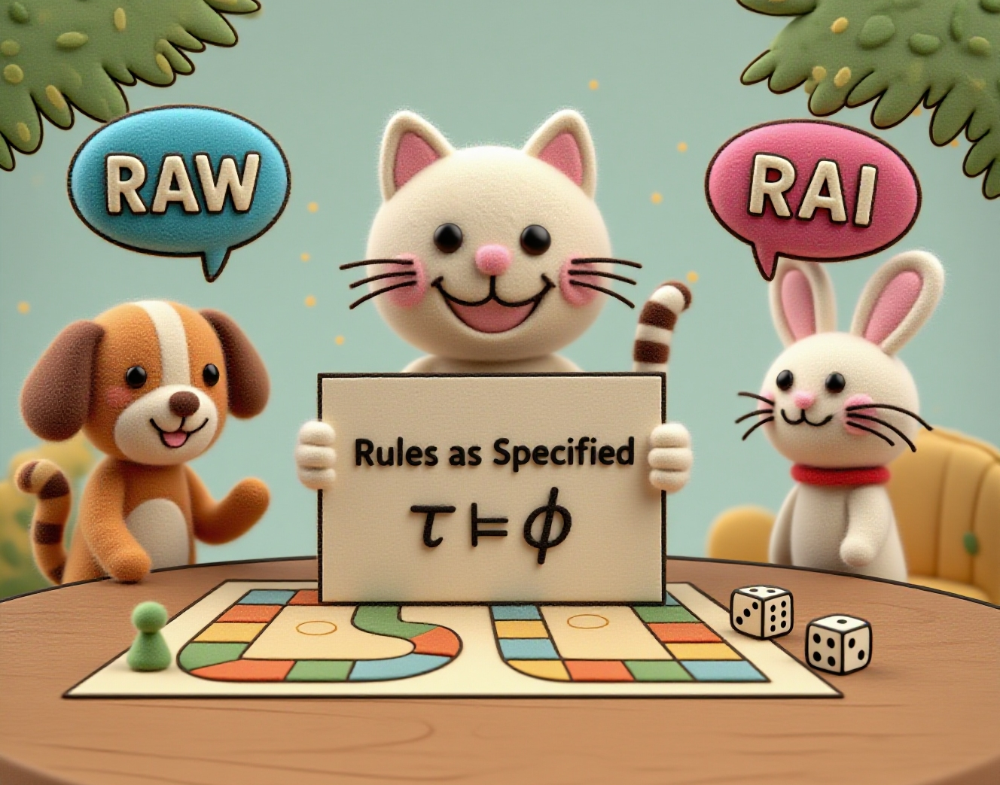

Rules as Specified — A Manifesto
---

Playing board games and tabletop role-playing games often involves two common interpretive approaches:

- _Rules as Written_ (**RAW**): To follow the rules as they are written, but the wording itself may be ambiguous.
- _Rules as Intended_ (**RAI**): To follow the rules as they were meant, but the authors’ intentions may be unclear, and players may disagree on what they are.

We propose a third approach, _Rules as Specified_ (**RAS**), where each rule’s specification can be verified. In this model, the rule’s intention must be sound, while its written form illustrates but does not determine the rule.

The RAS includes two steps:

**Step 1**: We are going to formalize the rules of board games in Lean 4. We aim to ensure that the rules are:

- **Deterministic**, never ambiguous. This does not mean the game cannot involve randomness or allow players to make choices.

- **Terminating or Live** – the game should either be guaranteed to terminate, or be guaranteed to continue (i.e., not get stuck).

**Step 2**: Generate the human-friendly rule explanation.

Examples in progress

- [Rules-as-Specified/boardgame](https://github.com/Rules-as-Specified/boardgame), including your favorite _Rock paper scissors ✊✋✌️_ with variants (one-round, N-rounds, untilWin).

Stay tuned! - arbipher